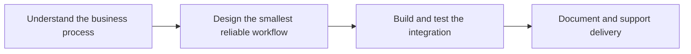

# Nasratul Nayem Portfolio

<p align="center">
  <strong>WordPress, WooCommerce, browser-extension, and automation engineering focused on real business problems.</strong>
</p>

<p align="center">
  
  
  
</p>

## Overview

This repository powers my public portfolio. I build practical systems for businesses that need faster WordPress operations, custom WooCommerce workflows, browser automation, and AI-assisted content production.

## The problem

Many businesses depend on repetitive manual work: copying product data, submitting URLs one by one, preparing content, moving media between tools, and maintaining fragile WordPress processes.

## The solution

I design focused tools that remove those repeated steps while keeping the workflow understandable for the people who use it.

## What it demonstrates

- Client-focused product thinking
- WordPress and WooCommerce development
- Python and API automation
- Browser-extension engineering
- Technical documentation and deployment

## Core capabilities

| Capability | Practical value |
|---|---|
| Importon Bridge | Alibaba-to-WooCommerce product importing with browser capture |
| GSC Bulk Indexer | Search Console workflow automation with quota awareness |
| WordPress AI SEO Writer | Gemini-assisted content generation and WordPress REST updates |
| Effortless WebP Converter | Safe batch image conversion and responsive WebP serving |
| AI Video Pipeline | Script, voice, visuals, captions, rendering, and publishing |
| Local WordPress Manager | Portable WSL and MariaDB development environment |

## Workflow



## Technology

- WordPress and WooCommerce
- PHP, JavaScript, HTML, and CSS
- Python and Flask
- React and TypeScript
- Chrome extensions
- REST APIs, Linux, WSL, Docker, and GitHub Actions

## Project status

**Active professional portfolio**

The website is built with Jekyll and GitHub Pages. Project descriptions are written around the problems solved and the implementation responsibilities.

## Run locally

```bash
git clone https://github.com/nasratulnayem/nasratulnayem.github.io.git
cd nasratulnayem.github.io
bundle config set --local path vendor/bundle
bundle install
bundle exec jekyll serve -l -H localhost
```

## Usage

Visit [nasratulnayem.github.io](https://nasratulnayem.github.io) to review services and selected work. For project inquiries, use [nayem.dev](https://nayem.dev) or LinkedIn.

## Engineering notes

- Configuration and credentials should be supplied through environment variables or local files excluded from Git.
- Generated output and runtime data should not be committed.
- Claims in this README describe the capabilities visible in this repository.
- Before production deployment, review authentication, rate limits, error handling, logging, and provider terms.

## Roadmap

- [ ] Add short demonstration videos for flagship projects
- [ ] Publish detailed case studies with measurable results
- [ ] Add a dedicated contact and project-intake path
- [ ] Keep project summaries synchronized with active repositories

## About the developer

Built by **Nasratul Nayem**, a WordPress, WooCommerce, and automation developer based in Dhaka, Bangladesh.

I build practical systems that remove repetitive work: WordPress plugins, WooCommerce integrations, browser extensions, Python automation, AI-assisted content pipelines, and internal business tools.

- Portfolio: [nayem.dev](https://nayem.dev)
- GitHub: [@nasratulnayem](https://github.com/nasratulnayem)
- LinkedIn: [Nasratul Nayem](https://www.linkedin.com/in/nasratulnayem)

## License

Review the repository license before reuse. Third-party services and APIs remain subject to their own terms.
